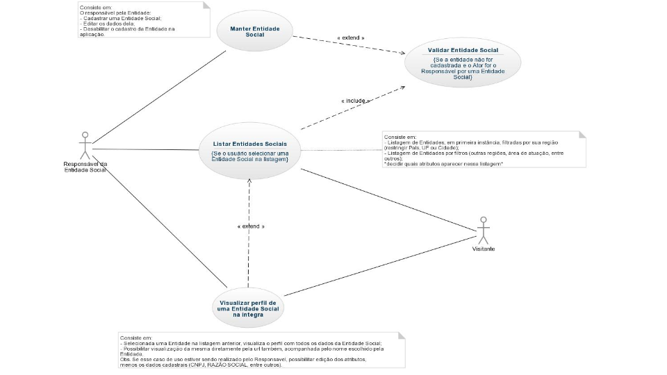
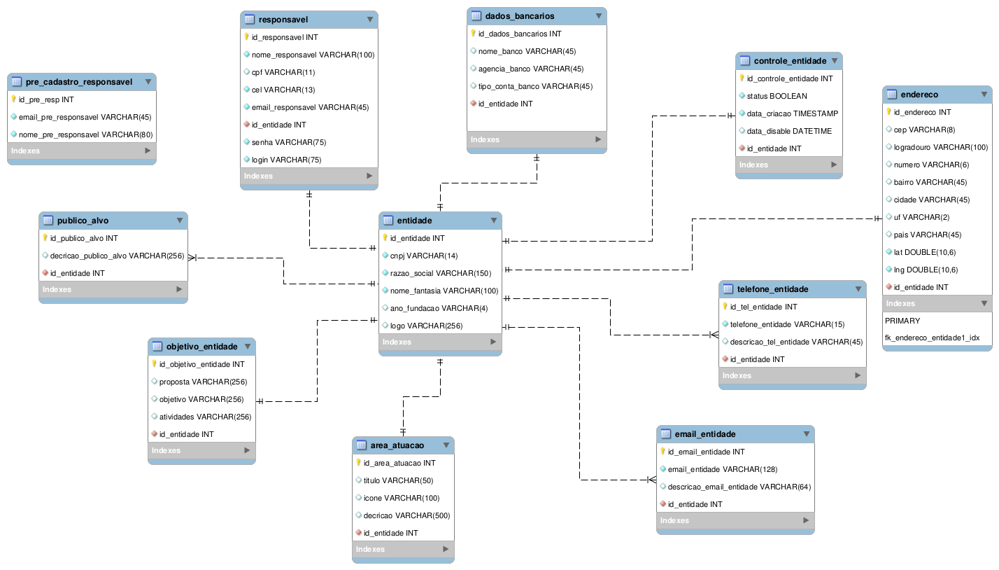

# Ongbook.org - Catálogo de Entidades Sociais e suas Necessidades
Criação social é o futuro da indústria, ainda mais quando se trata da nossa, a de software: _"bem-vindo à era das multidões! Bem-vindo à era do crowdsourcing!"_ [Endeavor](https://endeavor.org.br/crowdsourcing/)

>Por definição, o [crowdsourcing](https://pt.wikipedia.org/wiki/Crowdsourcing) combina os esforços de voluntários identificados ou de trabalhadores em tempo parcial, num ambiente onde cada colaborador, por sua própria iniciativa, adiciona uma pequena parte para gerar um resultado maior.
    
Acreditando nisso, propomos desenvolver o projeto em total harmonia com a comunidade do ecossistema de desenvolvimento de software e startups, mais precisamente de impacto social. Nossa documentação está aberta para acompanharem e participarem, gerenciando através deste repositório.
Mais informações sobre o desenvolvimento do projeto estão disponíveis em [Central Institucional - Ongbook](http://central.ongbook.org).

## Conteudo

1. [Descrição do projeto](#descricao-do-projeto)
    * [Visão geral](#visao-geral)
    * [Objetivos](#objetivos)
1. [Mini Mundo](#projeto-de-mini-mundo)
1. Documento de requisitos
    * [RNF](#requisitos) - Não Funcionais
    * [RF](#funcionais) - Funcionais
        * Sprint 1
            - [UC](#uc-sp1) - Casos de uso
            - [MER](#modelo-de-entidade-e-relacionamento) - Modelo de entidade e relacionamento

### Externos

* Documentação do front-end - **[mvp](https://github.com/Ongbook/mvp)**
* ~~Documentação do back-end - **[api-nodejs](https://github.com/Ongbook/ongbook-api)**~~ [pausado]
* ~~Apresentação da iniciativa na **[Wiki](https://github.com/Ongbook/documentacao/wiki)** (Associação, equipe, entre outros)~~

## Descricao do projeto
Como o nome já diz, _Ongbook_, Livro de ONGs. Um catálogo digital de Entidades filantrópicas. Essas Entidades poderão cadastrar suas necessidades, que por ventura venham surgir: bens materiais :jeans:, mão de obra (trabalho voluntariado :muscle:) e de recursos financeiros :moneybag:. Necessidades serão objetos da aplicação, as quais poderão ser listadas por diferentes filtros (localização pela região, área de atuação, proximidades, entre outros).

A aplicação é especializada em levar essas informações (_necessidades cadastradas por coordenadores de Entidades Sociais_) ao seu público-alvo (_usuários, pessoas físicas com perfis solidários_), com o objetivo de supri-las. Unindo solidários com necessitados.
A mínima ação solidária que o usuário que recebeu a notificação pode fazer, é compartilhar e divulgar para um amigo a determinada necessidade. Isso nós já consideramos uma conquista, a venda da ideia da nossa iniciativa :star:

### Visao geral

Existe uma carência quando se trata de pessoas, em manter-se atualizadas e em interação com Causas e necessidades presentes no dia a dia de Entidades que trabalham para suprir problemas sociais em geral. Também vislumbramos a possibilidade de ajudar essas instituições do terceiro setor, oferecendo uma plataforma online e inovações tecnológicas.

### Objetivos

#### Do resultado
- Evidenciar atividades de Entidades Sociais, cadastrando e listando suas necessidades e, notificando-as às pessoas com os perfis afins;
- Suprí-las através da interação social;
- Promover voluntariado e incentivar solidariedade;
- Possiblitando que mais pessoas sejam amparadas;
- Incentivar e exercer a solidariedade, com credibilidade, de forma divertida, inovadora e tecnológica e com seriedade. :pray:

#### Do processo
- Produzir software com qualidade, junto com a comunidade;
- Implantar metodologias ágeis nos processos e fazer o simples e necessário - **[Getting Real](http://gettingreal.37signals.com/GR_por.php)**;
- Gerenciar ciclo de vida da aplicação, da concepção dos requisitos ao deploy;
- Entregar valor (funcionalidades) em cilcos, testando as hipóteses junto ao publico usuário (De um lado, os coordenadores de Entidades Sociais, no outro, usuários solidários).
- O mais importante é uma comunicação clara, rica e colaborativa entre os integrantes da equipe, stakeholders, comunidade e usuários. Seguindo os princípios do [Manifesto Ágil](http://www.agilemanifesto.org/iso/ptbr/): *"Os processos ágeis promovem desenvolvimento sustentável"*.

**[⬆ volte ao topo](#conteudo)**

## Projeto de Mini Mundo
Um usuário solidário deseja uma aplicação web onde seja possível listar Entidades Sociais, que possibilite filtrar a listagem por Área de atuação da Entidade (ex.: Proteção de animais, crianças especiais, combate à fome, entre outros), por região (Cidade, UF, País) e próximas a ele, podendo definir o raio de circunferência (ex.: 10 Km, 20 Km), exigindo que ele autorize a aplicação saber sua geolocalização para utilizar esta funcionalidade do seu smartphone ou do browser do computador.

Para uma Entidade Social aparecer na listagem do site Ongbook.org, o cadastro da mesma, deve ser feito pelo seu responsável, que optando por fazer, deverá ir até o site na seção (link) “Cadastrar Entidade Social”, e primeiramente informar seu e-mail e nome, para receber o e-mail que confirme o usuário com um link que redirecionará novamente para o site, para cadastrar os dados da Entidade Social (CPF do Responsável, CNPJ, Razão Social, Presidente respondável, logomarca, Nome fantasia, Endereço, Área de atuação*, dados para contato (e-mail, tel, site, fanpage), Proposta (máx. 200 caracteres), Objetivo (o mesmo), Atividades (o mesmo), Necessidades (um campo para cada necessidade que são, necessidade de dinheiro (semanal ou mensal), necessidade de material e insumos (semanal ou mensal), necessidade de voluntários. E também um nickname para registro de URL (que não poderá ser repetido em todo sistema, sendo único).

Uma Entidade Social cadastrada só deve aparecer na listagem após sua validação, que é a confirmação de seu CNPJ (Cadastro Nacional de Pessoa Jurídica). O responsável pela Entidade Social ainda deve ter a possibilidade de EDITAR (menos o cnpj) e DESABILITAR o cadastro da mesma no site, nunca excluir.

*As Áreas de atuação devem ficar numa tabela exclusiva para elas. Cada Área de atuação, alem do código, terá um título, descrição e uma imagem (ícone) para melhor identificá-las e também estilizar e caracterizar em virtude da Experiência de Usuário (UX) no uso do site. A listagem deve ser feita com a integração do Google Maps, sendo que cada Entidade Social será representada no mapa pelo alfinete estilizado com o ícone da categoria (Área de atuação), marcando sua geolocalização conforme seu endereço.

A filtragem da listagem deve possibilitar mais de uma categoria na escolha dos filtros (“e” e “ou”) (ex.: UF = SP e, refina mais ainda escolhendo a AREA DE ATUAÇÃO = ANIMAIS).

Nessas listagens, que deverão ser apresentadas no Mapa do Google, através do alfinete (marcador) que será o ícone da Área de atuação, como dito acima, ao clicar ou tocar no alfinete da Entidade Social escolhida, por padrão, surgirá um balão, primeiramente só apresentando o Nome fantasia, logomarca, cidade e título da Área de atuação. E ao clicar no nome da Entidade nesse balão, deve direcionar para página que será a visualização do perfil da Entidade Social na íntegra, com todas as informações cadastradas no site Ongbook.org.

O perfil de uma Entidade Social também deverá ser visualizado sendo acessada diretamente pela url digitada no browser, o dominio do site acompanhado pelo nickname definido no cadastro (ex.: http://ongbook.org/ACACI).
Ainda nessa página do perfil da Entidade Social, e de cada uma cadastrada no site, deverá constar os botões das principais redes sociais (Facebook, Twitter, Google+ e Linkedin) para serem compartilhadas, levando em consideração as meta-informações e meta-descrições, que serão planejadas e estruturadas na organização dos objetos da aplicação.

**[⬆ volte ao topo](#conteudo)**

## Requisitos

### Não funcionais
Requisitos que não correspondem de fato a uma funcionalidade da aplicação. Tais requisitos foram divididos em três tipos:

#### De produto
ID | Descrição
------------ | -------------
RNF01 | Deve ser desenvolvido no modelo arquitetural RESTful[¹](https://pt.wikipedia.org/wiki/REST). Separando back-end (API oferecendo recursos via JSON) e front-end, consumindo esses recursos. Que também serão expostos para terceiros
RNF02 | Deve ser implementado com Stack MEAN (MongoDB, Express js, Angular js, Node js)
RNF03 | Hospedado em ambiente Nginx em instancia Linux

##### Usabilidade
ID | Descrição
------------ | -------------
RNF04 | Permitir ao usuário facilidades de uso, com uma interface gráfica intuitiva, garantindo que todas as funcionalidades estejam facilmente acessíveis. E evolua dinamicamente conforme a experiência do usuário (UX). Em browsers, smartphones e smart TVs

##### Segurança
ID | Descrição
------------ | -------------
RNF05 | Configuração de HTTPS, para manter um tráfego encriptado com SSL/TLS
RNF06 | Implementar autenticação OAuth2 para requisições

##### De processo
ID | Descrição
------------ | -------------
RNF07 | Código fonte versionado com Git, exposto em repositórios no Github
RFN08 | Uso de TDD - Desenvolvimento Dirigido a Testes, automatizados. E implementação de ferramentas de integração contínua

##### Documentação
ID | Descrição
------------ | -------------
RFN09 | Devem ser elaborados artefatos e documentos necessários para melhor compreensão dos requisitos descritos. serão elaborados antes do ciclo de desenvolvimento e devem estar abertos a participação pública* na internet
RFN10 | A documentação dos requisitos deve acompanhar os ciclos de desenvolvimento de software (Sprints). Para servir de apoio aos integrantes da equipe, stakeholders e comunidade

#### Externos

##### Econômicos
ID | Descrição
------------ | -------------
RFN11 | A aplicação não deve exigir muito dos recursos (processamento e memória) dos diversos dispositivos nos quais esteja sendo executado. (Browsers PC e mobiles, Smart TVs, app nativos iOS, Android e Win mobile)

##### Legais
ID | Descrição
------------ | -------------
RFN12 | Antes do cadastro na aplicação os usuários deverão ter disponível o **Termo de cadastro de Entidades Sociais** e **Política de Privacidade de Usuários**, a fim de garantir a responsabilidade dos mesmos com as ações realizadas na aplicação

**[⬆ volte ao topo](#conteudo)**

### Funcionais
Os requisitos funcionais descrevem as ações do sistema, isto é, as funções necessárias para alcançar os objetivos do sistema.

#### 1º Sprint
ID | Nome | Prioridade
------------ | ------------- | -------------
RF-1 | Cadastrar Entidade Social | Essencial
RF-2 | Atualizar dados do perfil da Entidade Social | Essencial
RF-3 | Desabilitar, nunca excluir Entidade Social | Essencial
RF-4 | Listar Entidades Sociais por filtros | Essencial
RF-5 | Visualizar perfil da Entidade Social na íntegra | Essencial

**[⬆ volte ao topo](#conteudo)**

##### Caso de Uso do 1º Sprint

**[⬆ volte ao topo](#conteudo)**

##### Modelo de entidade e relacionamento

**[⬆ volte ao topo](#conteudo)**
